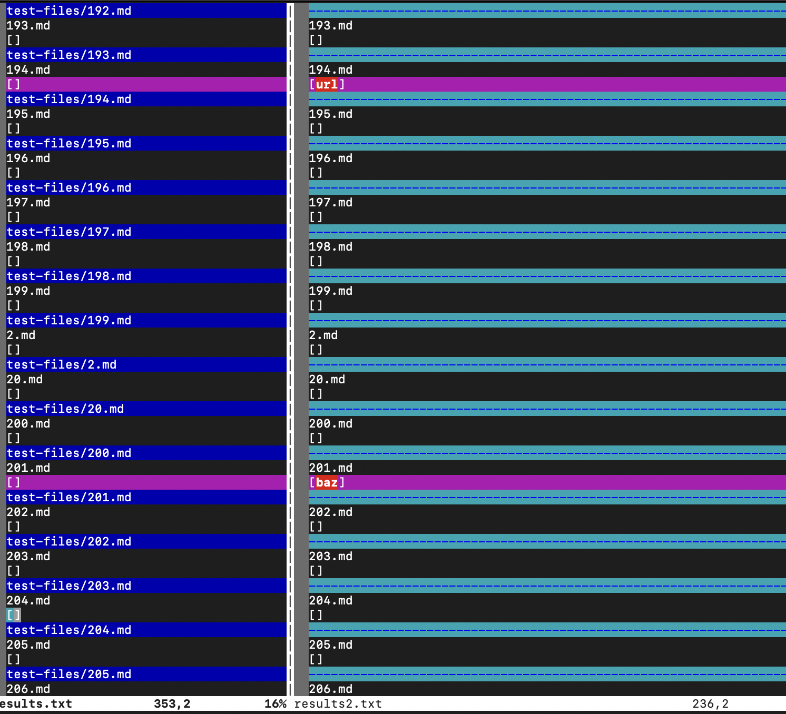

We used `vimdiff` to find out differences in the test result.  
*Note that the screenshot is a bit messy*
  
We are able to locate 2 different tests which are [194](https://github.com/nidhidhamnani/markdown-parser/blob/main/test-files/194.md) and [201](https://github.com/nidhidhamnani/markdown-parser/blob/main/test-files/194.md).  
Caused by different issues.  
  
  
This is how they suppose to be looked like:  
  
  
**Both** implementation has failed. 
What's going on here is in 194 there seems to be a special format of adding a link, which causes both implementations failed. 
