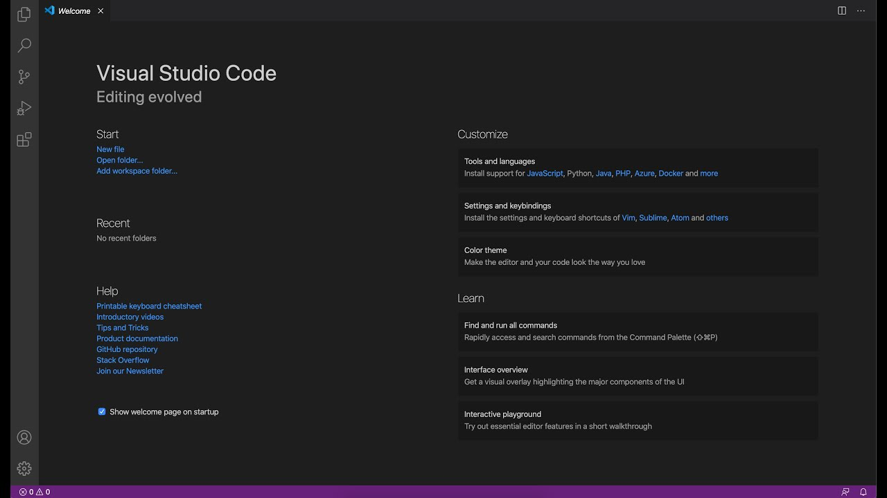
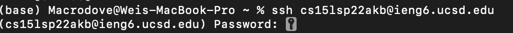
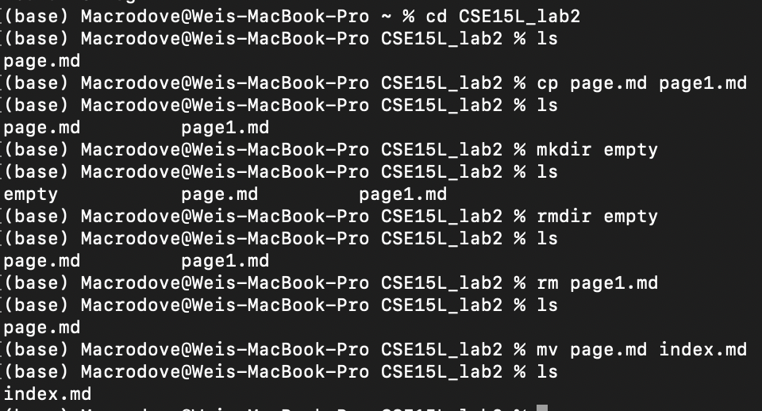
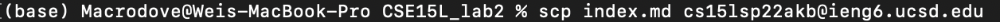
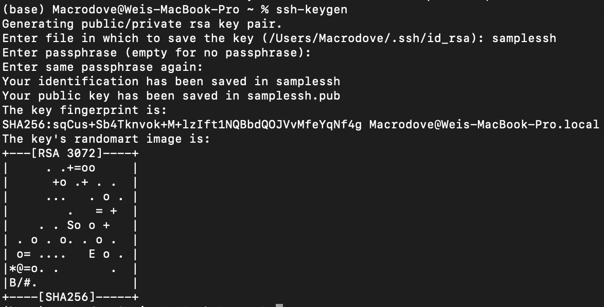

***This is the lab report page for CSE15L lab2***
---
## Step1  
**Setting up VScode**  

You can install VScode using the link below [Download VScode](https://code.visualstudio.com/download)
  
With none UNIX system, you will need the terminal of VS code for unix command in the following steps.  
## Step2  
**Remote connecting via ssh**  
Use `ssh host` to connect to the host sever.  
*ssh stands for secure shell*

After using the `ssh` command, the field requires the password to connect to the host, which in this case is a remote terminal.
## Step3
**Unix Commands**
- `cd` command can be used to navigate through directories
- `ls` command is used to show all files in the directory
- `rm` is used to remove files from current directory
- `rmdir` removes a directory
- `cp` you can use this command to rename or make a copy of files
  
Here is a sample usage of basic unix commands on my terminal
  
We first use `cd` command to check CSE15L_lab2 directory, and we use `ls` to see what's inside.  
We copied page.md and name the copy page1.md with `cp` command.  
Then we create a directory named empty with `mkdir` then we `rmdir` to remove it.  
And we remove the copy with `rm`.  
Finally we rename page.md with `mv` command to index.md.  
  
**For more Unix command, you can check [wiki Unix command list](https://en.wikipedia.org/wiki/List_of_Unix_commands)**
## Step4
**SCP**  
*SCP stands for secure copy*  
With `scp file host` command, you can upload local file to the remote terminal.  
Here is a sample of how to use the command.  

## Step5
**SSH key**
use `ssh keygen` to generate sshkey.  
Here is a sample of how to generate the key on my macbook terminal
  
With sshkey, you can connect to the host without providing the password when connecting to your remote terminal.  
And github has a very detailed explaination of what a [sshkey](https://docs.github.com/cn/authentication/connecting-to-github-with-ssh/about-ssh) is.
