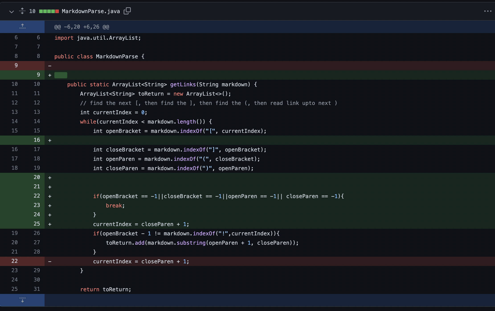
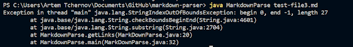
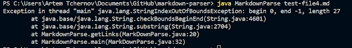
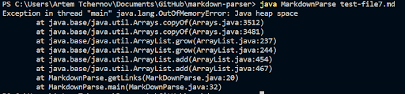
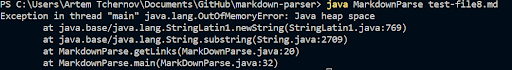
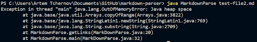

# Lab Report 2
this is about creating and debugging of the markdown parse program regarding some specific symptom inducing inputs.  
Here is the screenshot of all changes made during the debugging push on github.  
  
Here is our [link to repo](https://github.com/Atch19/markdown-parser)
  
We have five error inducing inputs that causes error in the first version of our program, they are:  
1. [input 2]e(https://github.com/Atch19/markdown-parser/blob/main/test-file2.md)  
3. [input 3](https://github.com/Atch19/markdown-parser/blob/main/test-file3.md)  
4. [input 4](https://github.com/Atch19/markdown-parser/blob/main/test-file4.md)  
5. [input 7](https://github.com/Atch19/markdown-parser/blob/main/test-file7.md)  
6. [input 8](https://github.com/Atch19/markdown-parser/blob/main/test-file8.md)  
  
In these inputs `1,4,5` are the showing the same symptoms and `2,3` are showing the same symptom.  
  
*First class* error are out of heap error caused by infinite loop,this is because there is only some component of the link appears in the target file, and the search needs a complete link to update the search index which is compared in the while loop, and thus the loop will never ends. This is fixed by adding if statement with break in the loop to terminate the loop if the next feather element in a link cannot be found.    
*Second class* error are index out of bound exceptions, which is similar to the first one, this is because we cannot find `)` at the end of a link, and such input will cause the program update next index to `-1` by default return of string search, which obviously is illegal index inside a string. We fixed this bug basically with the same if statement and break just like solving for the first class.
