## Lab Report 3

### Part 1
Here we show how to modify ssh config file. First we simply use command `cd .ssh` to go to the ssh directory.  
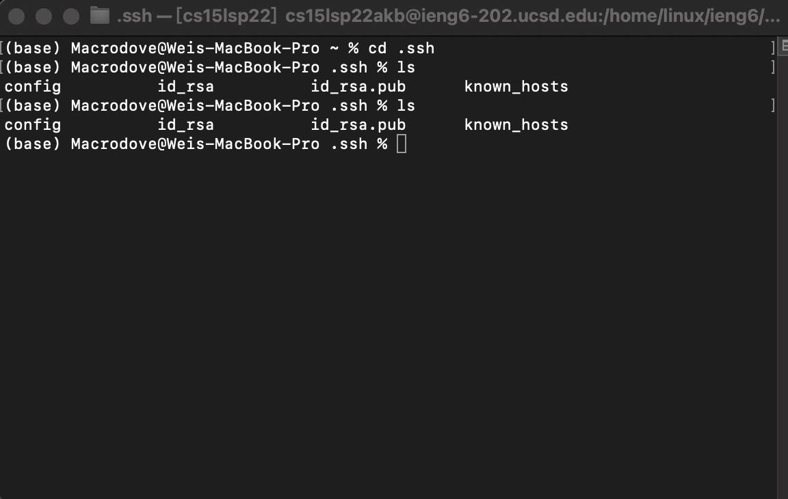  
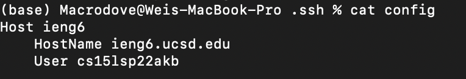  
Now we can modify this file via many ways, and I'm going to use `vim filename` here to modify this file.  
  
Now we can simply use `ieng6` to login to remote instead of the full name.  
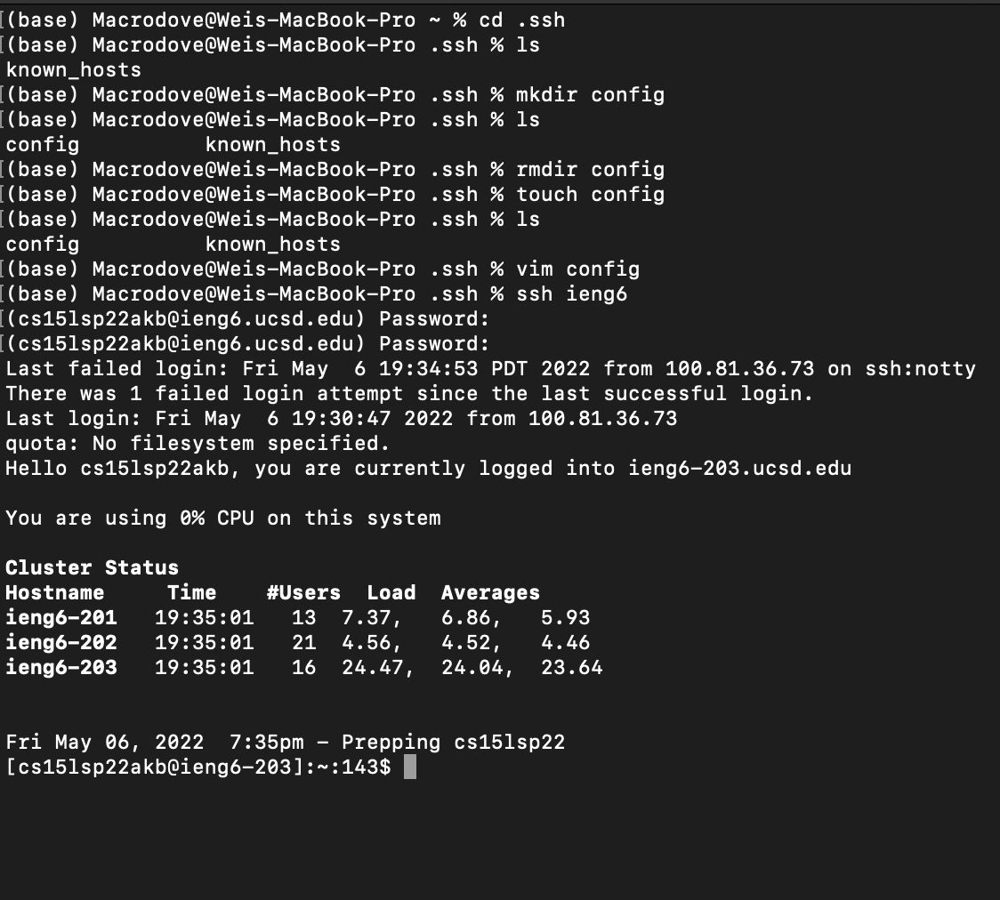
Similarly for `scp` command.  
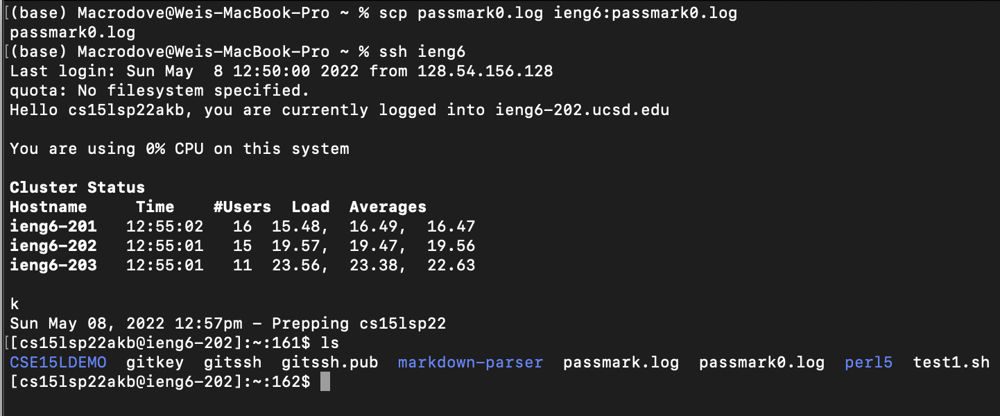  
  
### Part 2
We are going to set up git streamline on remote terminal. Go to profile-setting-developer setting to generate key.  
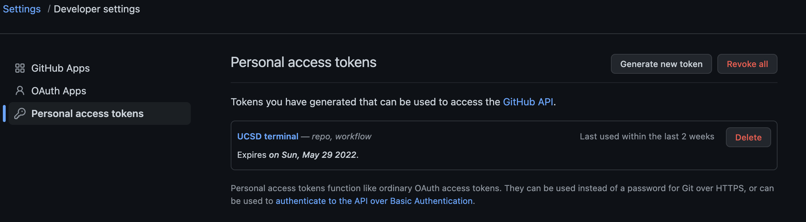   
We save the generated key to somewhere for easy access.  
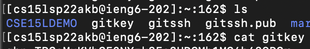  
Now we use git commands, first we go to a existing repo and make change to a file.  
We make change directly on terminal using vim to the demo two sum java code
  
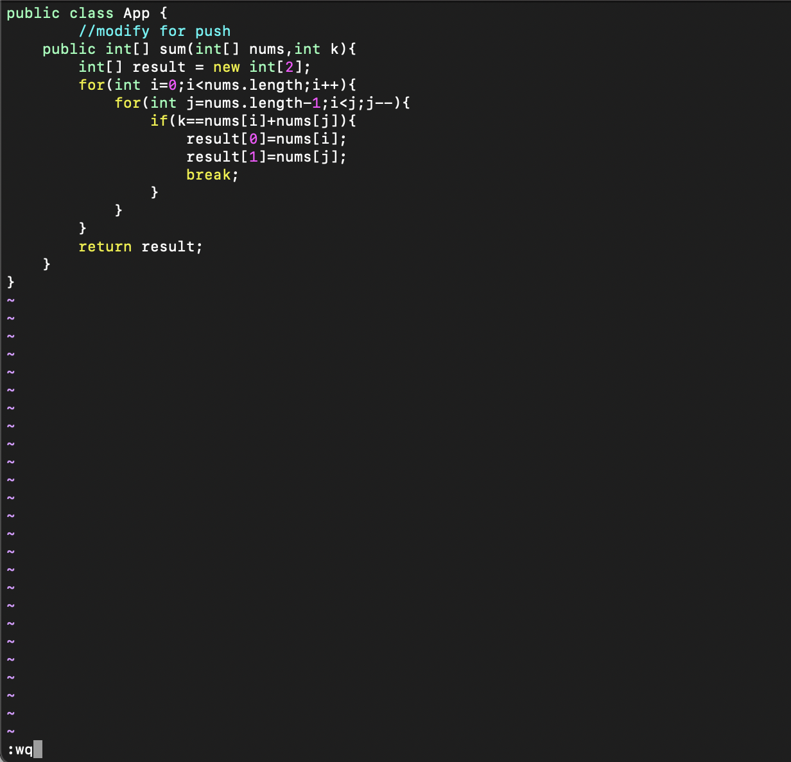  
We now we commit and push.  
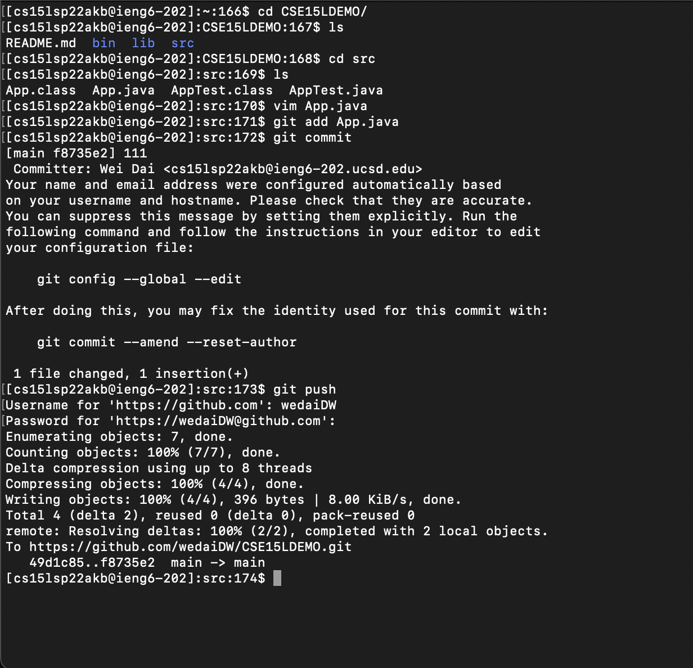
  
### Part 3
We can use `scp -r` command to upload whole directory!  
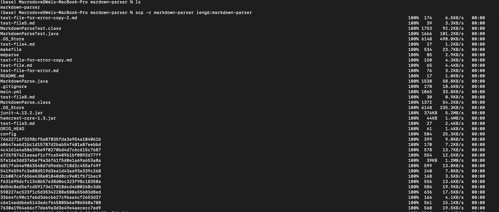  
And we check our remote repo, also if our program runs. Since we already create the makefile we can just use `make test` to run desired tests while compling java file.
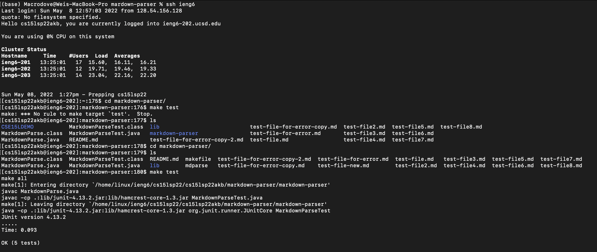  
Now we make everything in to single line.  
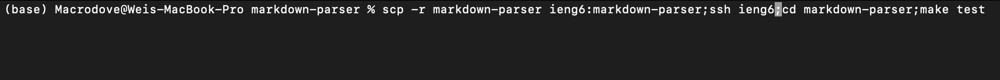  
Check if runs:   
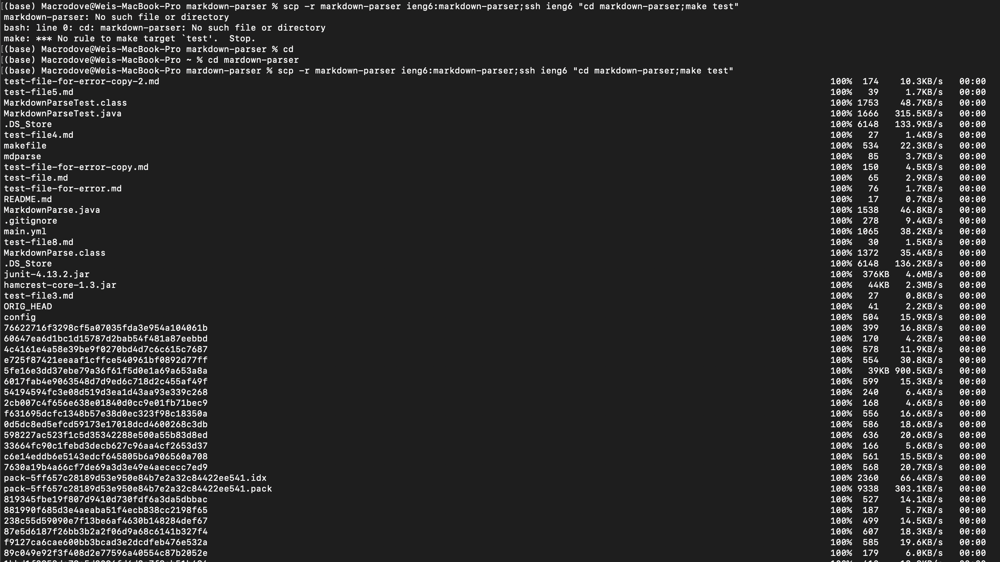  
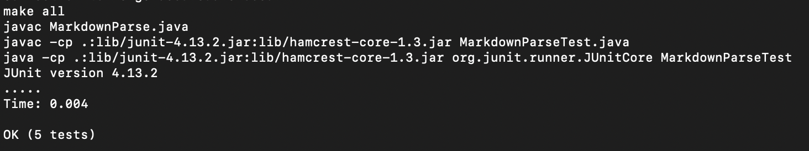
