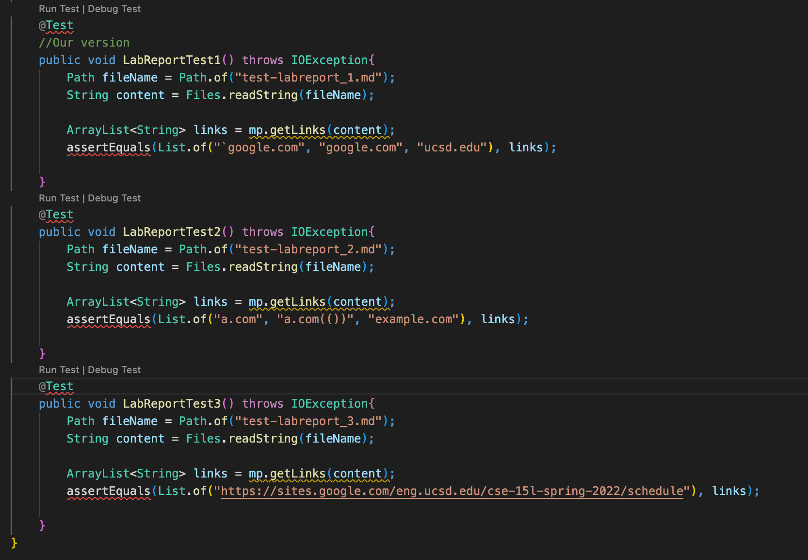
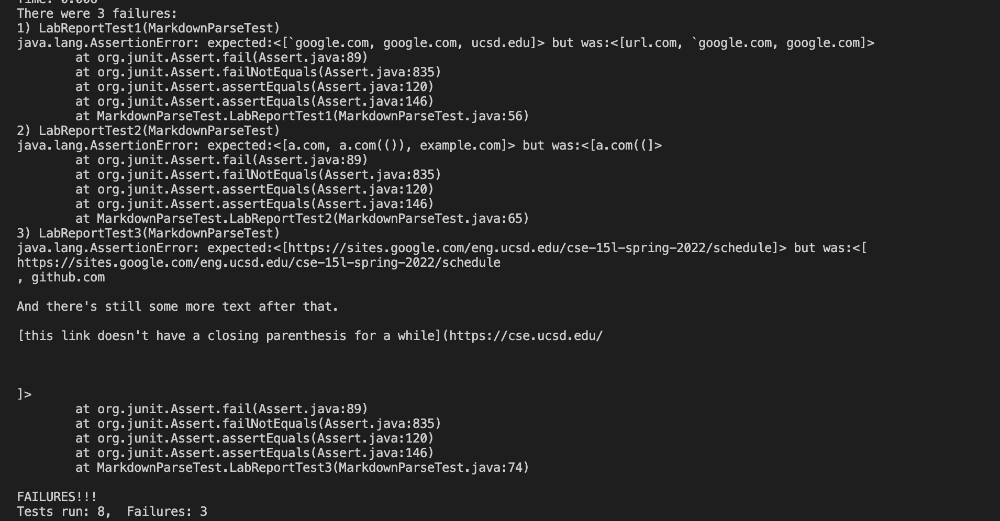
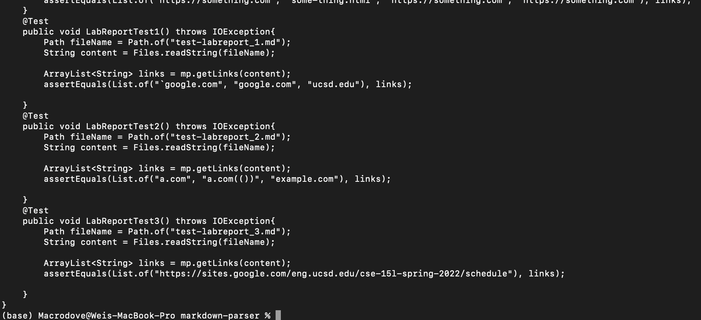
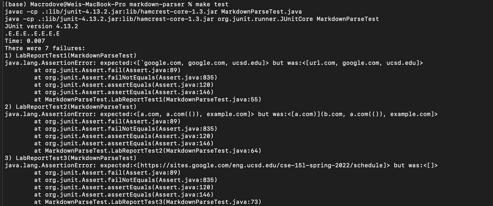

We use the given markdown file to update our tests, and here are new test files.  
Here is our testfile.  
  
And here is our result:  
  
There are some kind of failures in each of the test cases. And we will analyze why these case may fail later in this report.  
Now we need to show the modified testfile and test result for the one we reviewed.  
  
Test result  
  
### Analysis of failing case and potential improvement  
For the first test case, both implement runs into the same error, both are not considering the case that is wrapped with \`  
To fix this case, just add a detection method like the one to distinct from image and link and this should pass the test case.  
Then for the second case. In this case, although both implement failed, the output is caused by different mechanism. First of all, both implement failed to solve nested links, however, in outputwise, they are having an output that is closer to expected than ours. This is because in their implementation they are considering line wise rather than whole file. To fix this is more complicated than just few lines of code, because the nested link have a specific order of which link is to be render as a link. The implement will have to match the parenthesis while matching the correct link.  

