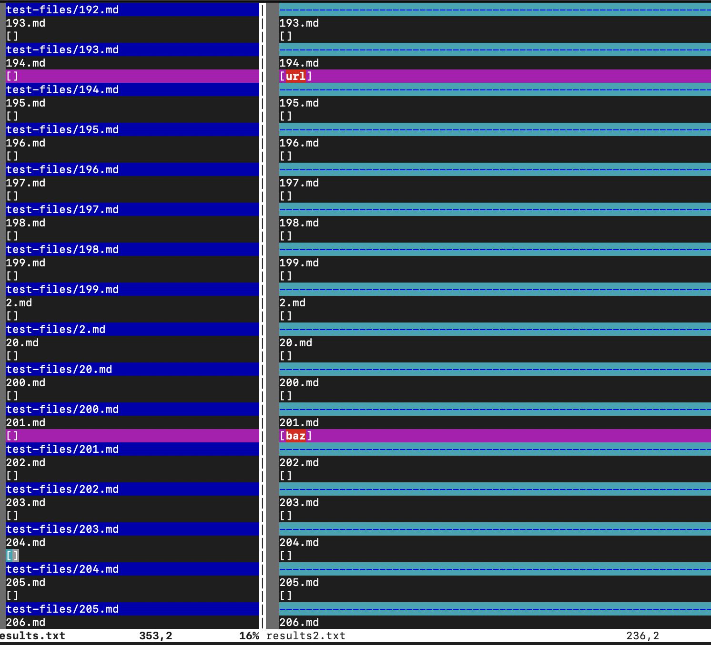
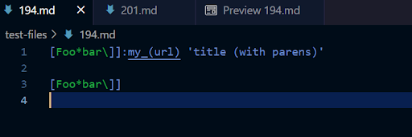
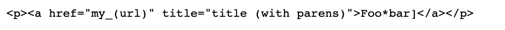
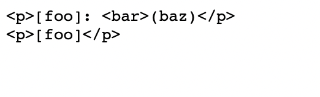
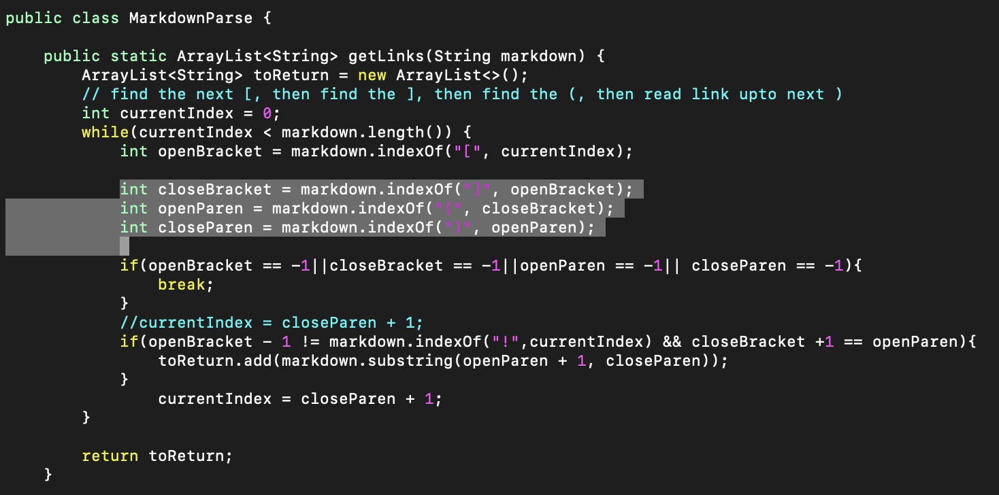

We used `vimdiff` to find out differences in the test result.  
*Note that the screenshot is a bit messy*
  
We are able to locate 2 different tests which are [194](https://github.com/nidhidhamnani/markdown-parser/blob/main/test-files/194.md) and [201](https://github.com/nidhidhamnani/markdown-parser/blob/main/test-files/194.md).  
Caused by different issues.  
  
  
This is how they suppose to be looked like:  
  
  
  
  
**Both** implementation has failed on 194. 
What's going on here is in 194 there seems to be a special format of adding a link, which causes both implementations failed. 
A potential fix is that we take this kind of link into consideration and add a detection method for it.  
**Our** implementation failed for 201.  
There is a comment in the markdown source between two componenet of link, a potential fix is add a argument here.  

We check if next index is the parenthesis if not we just break the loop.
